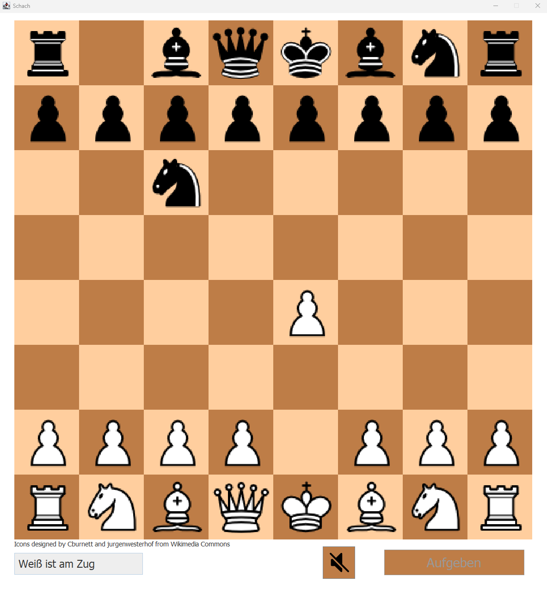

This is a personal project of mine that I did back when I was still in school (around 2018) and I found it to be a great exercise in object-oriented programming. 

The application consists of three main parts:
1) a chess engine managing the game state and checking move legality (some more complicated rules like en-passant have been left out)
2) a simple AI opponent, using the min-max algorithm with alpha-beta pruning and some minor optimizations (e.g. iterative deepening which enables greater depth at the end of the game when few pieces are left) 
3) a simple UI
   
